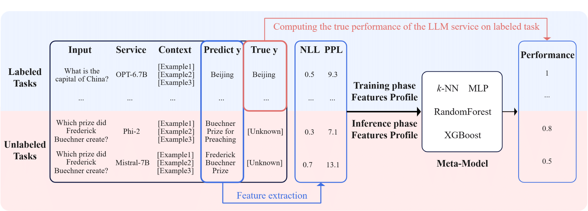
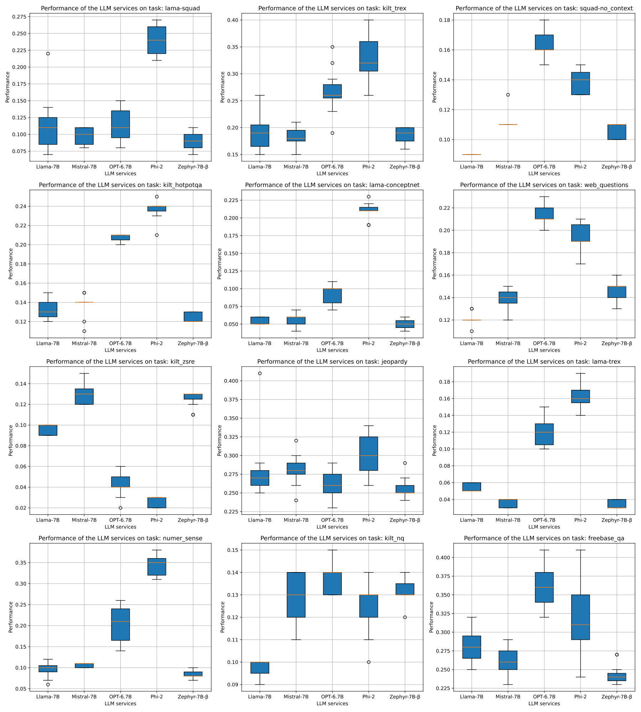

# Plug-and-Play-Estimation


This repository supports our work：Plug-and-Play Performance Estimation for LLM Services without Relying on Labeled Data (<a href = "https://arxiv.org/pdf/2402.03408.pdf">Arxiv</a>).

<div align="center">
  
</div>

### Introduction

Large Language Model (LLM) services exhibit impressive capability on unlearned tasks leveraging only a few examples by in-context learning (ICL). However, the success of ICL varies depending on the task and context, leading to heterogeneous service quality. Directly estimating the performance of LLM services at each invocation can be laborious, especially requiring abundant labeled data or internal information within the LLM. This paper introduces a novel method to estimate the performance of LLM services across different tasks and contexts, which can be "plug-and-play" utilizing only a few unlabeled samples like ICL.
Our findings suggest that the negative log-likelihood and perplexity derived from LLM service invocation can function as effective and significant features. Based on these features, we utilize four distinct meta-models to estimate the performance of LLM services. Our proposed method is compared against unlabeled estimation baselines across multiple LLM services and tasks. And it is experimentally applied to two scenarios, demonstrating its effectiveness in the selection and further optimization of LLM services.

The contributions of this paper are:

- We explore the common phenomenon exhibited during the invocation of LLM services, and select the available features based on their relevance.

- We propose a method for LLM service performance estimation that is able to reach low-error estimates at little cost on various unlabeled tasks, which can be applied to most LLM services that do not know the internal information.

- We verify the effectiveness of our method in two scenarios: the selection of LLM services and the further optimization for few-shot tasks of LLM services, proving that it can be helpful in various future works.

  

### Supplementary Material

- In Section1, we conduct experiment to prove "ICL is highly sensitive to task and context". We select top 5 generative LLM services according to the downloads of huggingface model library (\url{https://huggingface.co/models}). The experiments are conducted on 9 ICL tasks with 10 different contexts, which consists three randomly sampled examples. Different LLM services performs differently on the same task. Similarly, on the same LLM service, the use of different contexts also results in different performance.

  <div align="center">
    
  </div>


  ICL can demonstrate significant advantages in certain tasks when using appropriate LLM services and contexts, such as solving entity linking tasks with the Phi-2 service. But it can be virtually ineffective in other scenarios, like solving web-question tasks with the Llama-7B service

- The intermediate files we obtained in the experiments are recorded in the folder *pkls*, including the embeddings of the LLM service answers, the extracted features, and the accuracy. Use the following code to read it：

  ```python
  loaded_data = defaultdict(lambda:defaultdict(list))
  directory = 'pkls'
  # 定义匹配模式的正则表达式
  pattern = r"(.+)_default_\dshot_seed(\d+)_(.+)"
  # 遍历目标目录中的所有文件
  for filename in tqdm(os.listdir(directory)):
      if filename.endswith(".pkl"):  # 筛选出.pkl文件
          filepath = os.path.join(directory, filename)
          with open(filepath, 'rb') as file:
              data = pickle.load(file)  # 加载.pkl文件中的数据
              # 使用正则表达式进行匹配
              match = re.match(pattern, filename)
              if match:
                  dataset_name = match.group(1)  # 提取数据集名称
                  model_name = match.group(3).rstrip('.pkl')   # 提取模型名称
                  seed = match.group(2)
                  # print(dataset_name, model_name, seed)
                  accs = data["accs"]
                  loaded_data[dataset_name][model_name].append(round(sum(accs)/len(accs),2))
  ```

- For details and download of the dataset, refer to [CrossFit: A Few-shot Learning Challenge for Cross-task Generalization in NLP - ACL Anthology](https://aclanthology.org/2021.emnlp-main.572/). And the hyperparameter choices for the models in the experiments are given in *res/setting.txt*.

